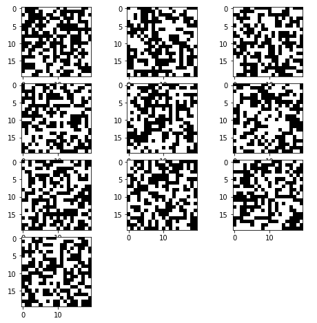
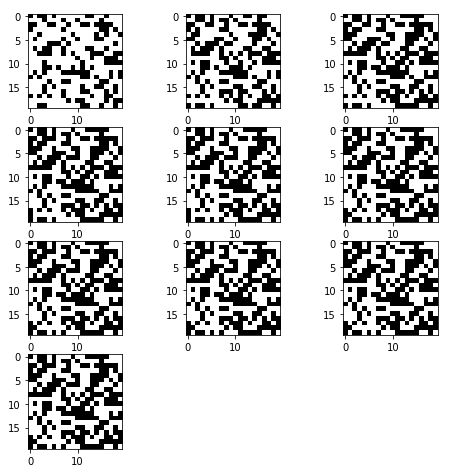
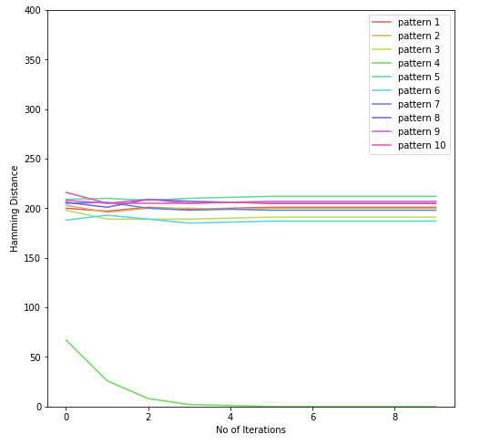
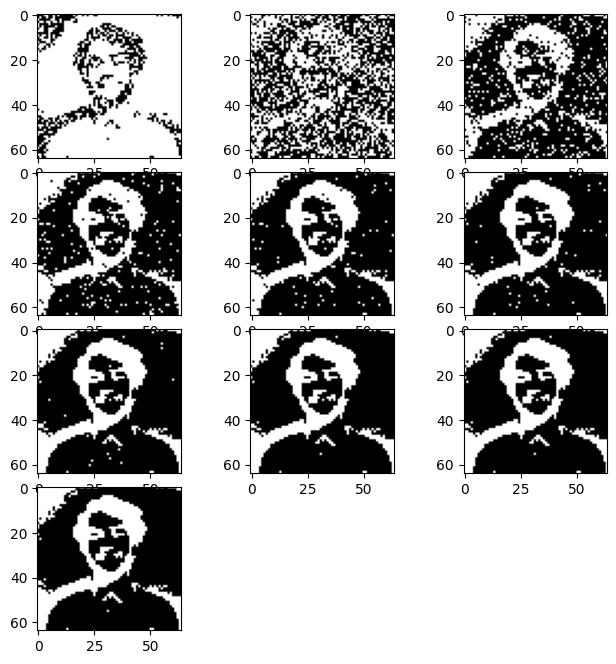
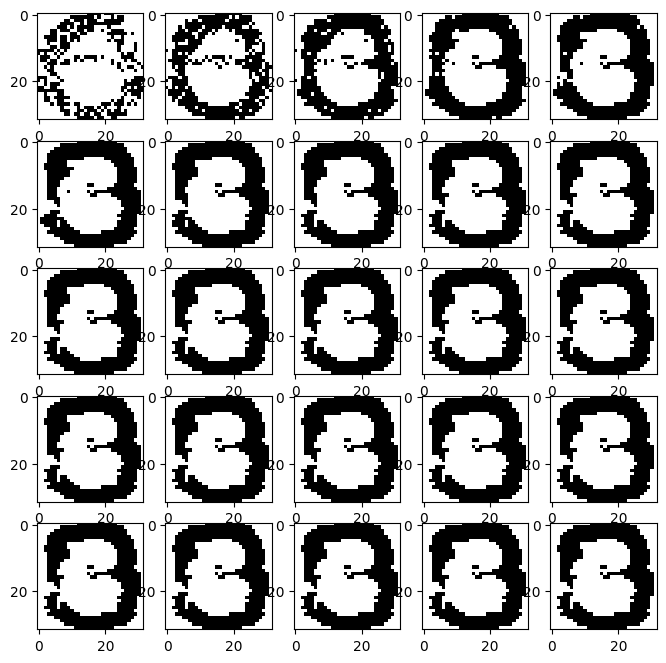
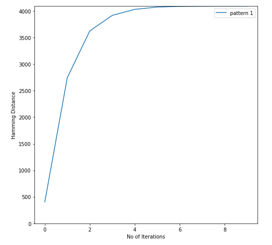
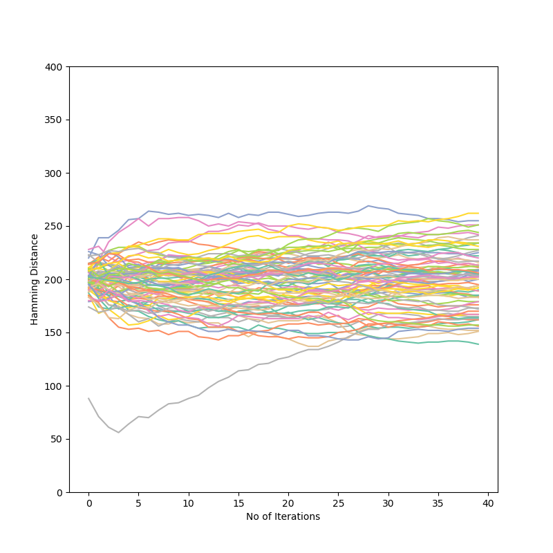

# Hopfield Network
Implementation of Hopfield Neural Network in Python based on Hebbian Learning Algorithm

## Example 1

## Example 2

## Implemented things:
 - Single pattern image
 - Multiple random pattern
 - Multiple pattern (digits)

## Just a good graph

